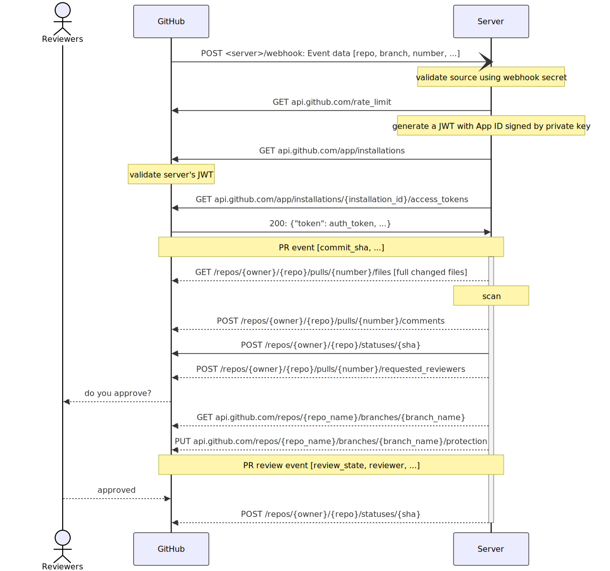

## Configuration Parameters Summary

| Parameter                 | Purpose                                            | Source | Required | Type                   | Default | Example              | Sensitivity |
|---------------------------|----------------------------------------------------|--------|----------|------------------------|---------|----------------------|-------------|
| SECRET_MANAGER            | SM to use (cli client, Python package, calls)      | user   | yes      | str                    | vault   | aws                  | low         |
| GITHUB_APP_PRIVATE_KEY    | Authenticates the app with GitHub                  | GitHub | yes      | str                    | -       | -----BEGIN RSA...    | critical    |
| GITHUB_APP_INTEGRATION_ID | Authenticates the app with GitHub (app ID)         | GitHub | yes      | str                    | -       | 1234567              | high        |
| WEBHOOK_SECRET            | Validates requests source (>32 random characters)  | GitHub | yes      | str                    | -       | 039e362cd52...       | high        |
| BRANCHES_INCLUDE          | Repos and branches to scan (all by default)        | user   | no       | dict[str, list \| str] | {}      | {'r1': ['b1', 'b2']} | medium      |
| BRANCHES_EXCLUDE          | Repos and branches to not scan                     | user   | no       | dict[str, list \| str] | {}      | {'r': 'all'}         | medium      |
| SECURITY_REVIEWERS        | GitHub accounts and teams to review detections     | user   | no       | list                   | []      | ['jdoe', 'team:sec'] | medium      |
| BLOCK_PR                  | Block merging in pull requests with detections     | user   | no       | bool                   | False   | True                 | low         |
| FP_STRICT                 | Run only `ERROR` severity rules, exclude `WARNING` | user   | no       | bool                   | False   | True                 | low         |
| FULL_FINDINGS             | Detect all findings instead of just the first one  | user   | no       | bool                   | False   | True                 | low         |
| WEBHOOK_PORT              | The port on which the app listens                  | user   | no       | int                    | 8080    | 8443                 | low         |
| JWT_EXPIRY_SECONDS        | Limit the app's GitHub auth token TTL              | user   | no       | int                    | 120     | 60                   | low         |

## Architecture Diagram

## Architecture Diagram: GitHub Enterprise

## Sequence Diagram

## Code Logic Flow Diagram

